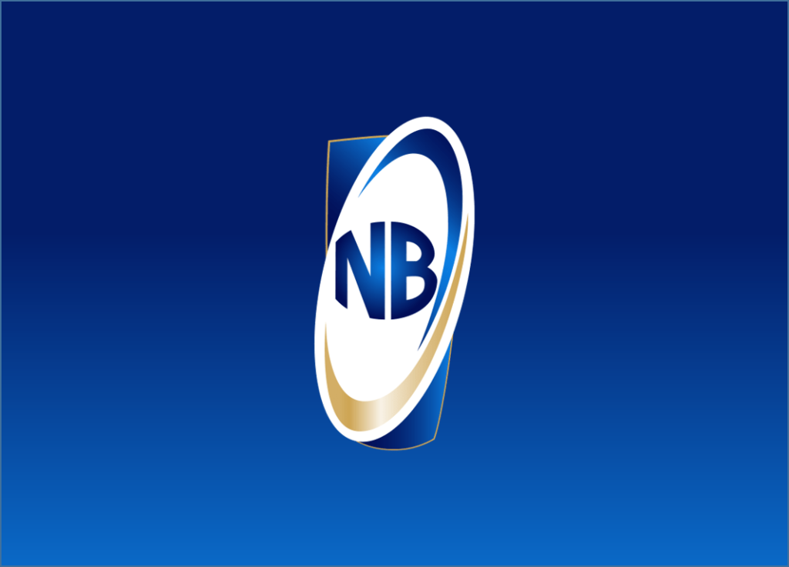
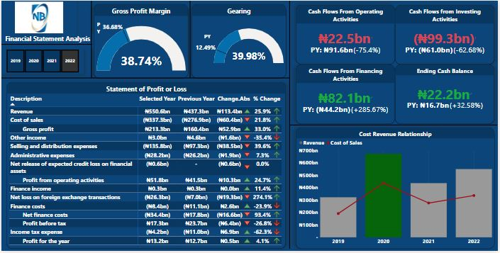

# Nigerian Breweries Fianancial Statement Analysis

## Introduction
To alleviate the tedious and monotonous nature of examining financial statements, I sought to infuse vitality and enjoyment into the process. As a result, I devised captivating visuals that effectively illustrate key aspects of the three primary financial statements. This innovative approach not only enhances the overall appeal but also provides individuals with valuable insights and understanding.

## Data Sourcing
The data was obtained from the NGX website and imported as a PDF file. Subsequently, data transformation and cleansing were performed using the power query editor.

## Visuals and Analysis

_Click [here](https://app.powerbi.com/links/jn_csMtqAc?ctid=f2c35211-7dad-42d6-b895-25d82fc1f0a2&pbi_source=linkShare) for dashboard interaction_

### Analysis
This analysis delves into the financial performance of Nigerian Breweries, focusing on the notable improvements in its gross profit margin, gearing, and the various components of its cash flow statement for the year 2022 compared to 2021. The aim is to examine the factors driving these changes and assess the overall health of the company. 

Nigerian Breweries experienced a significant improvement in its gross profit margin, which rose from 36.68% in 2021 to 38.74% in 2022. This increase suggests improved profitability and efficiency in the company's core operations, largely influenced by revenue growth. Factors contributing to this growth includes higher sales volumes, successful marketing strategies, and effective pricing mechanisms. These factors led to increased revenue generation which positively impacted the gross profit margin.

The gearing ratio measures the proportion of a company's debt relative to its equity. Nigeria Breweries saw a notable increase in its gearing ratio, climbing from 12.49% in 2021 to 39.98% in 2022. This indicates a higher reliance on debt financing, primarily due to increased borrowings reflected in the company's cash flow statement (from 67BN in 2021 to 161BN in 2022). Nigeria Breweries may have taken on more debt to support its operations, investments, or other strategic initiatives. This additional debt raised the gearing ratio, reflecting a higher level of financial leverage.

In 2022, there was a significant decline of 75.4% in cash generated from operating activities compared to 2021. This decline may be attributed to lower cash inflow from the company's core business operations.

Furthermore, there was an increase in the outflow of cash generated from investing activities. This suggests that the company made investments in acquiring fixed assets or capital projects, resulting in a higher cash outflow.

On the other hand, cash generated from financing activities experienced a remarkable improvement, growing by 285.67% in 2022. This increase indicates higher cash inflows from financing sources, such as increased borrowings as shown in the gearing ratio. The company raised additional funds through debt financing, resulting in higher cash inflows from financing activities.

Nigerian Breweries' ending cash balance grew by 32.58% in 2022, indicating a positive overall cash position at the end of the year. This growth suggests that despite significant decline in certain components of the cash flow statement, the company managed to maintain a healthy cash balance.

**_Analyzing a company's financial statements is crucial for making informed decisions about liquidity, profitability, and overall performance. Simplifying financial statements into easily understandable metrics and trends enhances comprehension. By examining the financial statements of Nigerian Breweries PLC and presenting them in simplified key metrics, we can obtain a general overview of the company's performance and financial health._**

